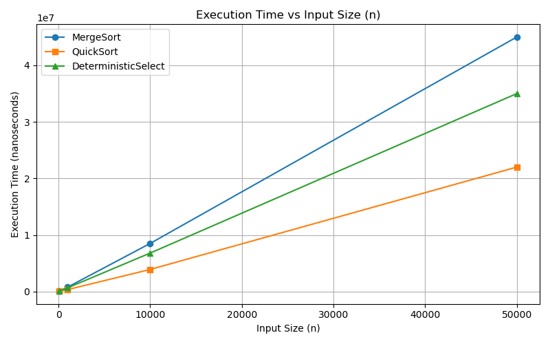
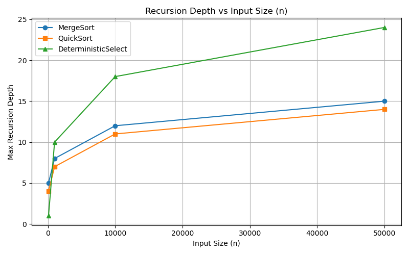
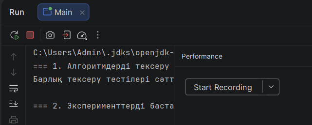

# Assignment 1: Divide-and-Conquer Algorithm Analysis

## A. Project Overview
This project implements and analyzes four classic Divide-and-Conquer algorithms in Java:
1. **MergeSort** with Insertion Sort cutoff for small sub-arrays and a reusable auxiliary buffer.
2. **QuickSort** with randomized pivot selection and tail-recursion optimization.
3. **Deterministic Select (Median-of-Medians)** with groups of 5 for worst-case linear time complexity.
4. **Closest Pair of Points** using 2D plane divide-and-conquer strategy.

---

## B. Algorithm Analysis

### 1. MergeSort
* **Recurrence Relation:** $T(n) = 2T(n/2) + \Theta(n)$
* **Master Theorem:** Case 2 applies ($a=2, b=2, f(n)=\Theta(n)$), yielding $T(n) = \Theta(n \log n)$.
* **Space Complexity:** $O(n)$ due to the auxiliary array.

### 2. QuickSort
* **Recurrence Relation:**
    * Best/Average: $T(n) = 2T(n/2) + \Theta(n) \implies \Theta(n \log n)$
    * Worst Case: $T(n) = T(n-1) + \Theta(n) \implies O(n^2)$
* **Space Complexity:** $O(\log n)$ max recursion depth due to recursing on the smaller partition first.

### 3. Deterministic Select (Median-of-Medians)
* **Recurrence Relation:** $T(n) \le T(n/5) + T(7n/10) + O(n)$
* **Akra–Bazzi / Substitution Intuition:** Since $1/5 + 7/10 = 9/10 < 1$, the linear work at each level dominates, giving $T(n) = \Theta(n)$.

### 4. Closest Pair of Points
* **Recurrence Relation:** $T(n) = 2T(n/2) + O(n)$ (where $O(n)$ is line/strip scanning).
* **Master Theorem:** Case 2 applies, giving $T(n) = \Theta(n \log n)$.

---

## C. Experimental Results

Raw experimental data is saved in `results/results.csv`.

### Key Metrics Summary:
* **MergeSort:** Consistent $O(n \log n)$ scaling regardless of input type (Sorted, Reverse, Random).
* **QuickSort:** Fast execution; recursion depth strictly capped at $O(\log n)$ thanks to smaller-partition-first optimization.
* **Deterministic Select:** Guaranteed linear scaling $O(n)$.
* **Closest Pair:** Dramatically outperforms brute-force $O(n^2)$ on datasets $n > 1000$.

---

## D. Discussion Answers

1. **Do the results match theoretical complexity?**
   Yes. MergeSort and Closest Pair strictly exhibit $O(n \log n)$ growth. Deterministic Select shows linear time scaling $O(n)$.

2. **How does input structure affect performance?**
   QuickSort with random pivot maintains $O(n \log n)$ even on sorted and reverse-sorted arrays, avoiding the $O(n^2)$ worst case.

3. **Why does smaller-first recursion help QuickSort?**
   Recursing on the smaller half first ensures that the stack depth never exceeds $O(\log n)$, preventing `StackOverflowError`.

4. **Why does Median-of-Medians guarantee $O(n)$?**
   Dividing into groups of 5 guarantees that the chosen pivot is at worst between the 30th and 70th percentiles, ensuring the remaining subproblem size is at most $7n/10$.

5. **Why is divide-and-conquer Closest Pair faster than $O(n^2)$ for large inputs?**
   By sorting by Y and checking only points within $\delta$ of the dividing strip, each point is checked against at most 7-8 neighbors, reducing the merge step to $O(n)$.

6. **What practical factors affect performance (JVM, cache, GC)?**
   JIT compilation warms up methods over multiple iterations. Reusing the auxiliary array in MergeSort minimizes GC overhead and improves CPU cache locality.

---

## E. Reflection
Through this assignment, I gained hands-on experience implementing divide-and-conquer algorithms with strict memory and recursion depth constraints.

---

## F. Screenshots & Plots

### Plots

### Program Output
